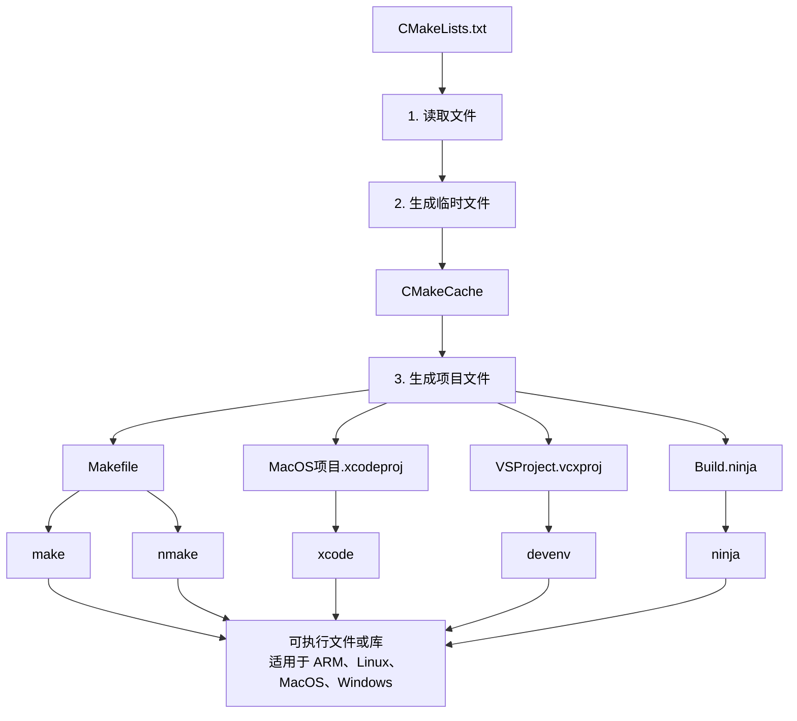

## Makefile简介

为了简化多个源代码文件下，通过 `gcc` 工具编译复杂的C语言项目，出现了 `Makefile`。

只要把 `GCC` 的各种控制和编译选项编写到 `Makefile` 文件中，再使用 `make` 工具解析，然后调用 GCC 执行编译即可，实现编译（构建）自动化。


## Makefile规则

整体规则:
```
<target> : <prerequisites>
[tab] <commands>
```

第一行冒号前面的部分叫做 “目标”（target），冒号后面的部分叫做 “前置条件”（prerequisites），第二行必须由一个 tab 键起始，后面跟着 “命令”（commands）。

“目标” 是必需的，不可省略。“前置条件” 和 “命令” 是可省略的，但是这两者至少需要存在一个（两者不能同时省略）。


示例：

1. 新建 `Makefile` 文件，注意第二行开始的空格，必须用 `TAB` 键。
2. 新建 `temp.txt` 文件，内容随意
3. 执行 `make hello.txt` 命令，创建 `hello.txt` 文件。

```
hello.txt: temp.txt
    cp temp.txt hello.txt
```

`Makefile` 规则文件：文件名为 `Makefile` 或 `makefile`， 不需要扩展名。

也可以使用 `-f` 指定 `Makefile` 文件名：
```
make -f config.txt
make --file=config.txt
```


## CMake介绍




1. 创建 `CMakeLists.txt` 文件
2. 生成 `MakeFile` 文件

```
#要求最低的cmake版本号
cmake_minimum_required (VERSION 3.5)

#项目信息
project (Hello)

#递归查找src目录下所有的后缀为c的文件，并保存在SRCS变量中
file(GLOB_RECURSE SRCS "./src/*.c")

#递归查找src目录下所有的后缀为h的文件，并保存在SRCS_H变量中(这是一种很不规范的写法，但是我这里为了省时，正常应该是使用设置头文件libraries的函数)
file(GLOB_RECURSE SRCS_H "./src/*.h") 

#设置输出路径为build路径
set(CMAKE_RUNTIME_OUTPUT_DIRECTORY "./build")

#用src下的源文件生成一个叫Hello的可执行文件
add_executable(Hello ${SRCS} ${SRC_H})
```

```
# Windows下生成MinGW的MakeFile
cmake CMakeLists.txt -G "MinGW Makefiles"

# Linux下生成Gnu的MakeFile
cmake CMakeLists.txt -G "Unix Makefiles"
```


## xmake介绍

[xmake](https://github.com/xmake-io/xmake): 一个基于Lua的轻量级跨平台自动构建工具，现代化的 C/C++ 构建工具，强大的依赖包管理和集成

- 官方文档：https://xmake.io/
- 项目地址：https://github.com/xmake-io/xmake


## xmake与cmake的区别

其实，两者并不是同一个层面的工具。
cmake的定位是跨平台胶水，xmake的定位是跨平台构建。
例如 vscode 跟 qtcreator ，还有 clion, kdeveloper 等等，非常多的 C++ IDE 都可以直接拿 `CMakeLists.txt` 作为 `项目文件`（project file）。它的重点并不在于构建，而在于「跨平台跨IDE的 `project file`」。

它作为跨平台，跨 IDE 的项目文件，实际上起到的是胶水作用：在不同平台调用属于不同平台的原生构建工具，在不同 IDE 中调用不同编译器，所以非常显见的，cmake在不同平台会有不同的行为，你跨平台的情况下，需要针对不同平台都调试过才好用。

cmake 的这个特性，使得各平台各IDE都愿意原生内置 cmake 支持。因为 cmake 只是个胶水，它同时依然允许了平台自身的包管理系统的存在，也允许了平台自身的编译系统存在（比如make, ninja，msvc 等等）。

而 xmake 则是「某个构建系统」。从构建系统的角度，xmake 无疑是比 cmake 更强大更好用的系统。但是，xmake 取代了构建系统本身，而并非像 cmake 这般仅作为跨平台胶水而存在。取代构建系统意味着 xmake 会具备更完善的功能以及更稳定一致的表现。所以它有很大概率是更好用的。

但这同时也决定了它可能会更少的被其它商业平台或者IDE内置支持，也很难获得 cmake 这般「C++构建系统事实标准」的地位。因为拥抱 xmake 意味着放弃自有构建系统，而引入 cmake 不会影响自有体系的存在。


----------

> Makefile规则详解 https://blog.csdn.net/jf_52001760/article/details/131277015
> 项目构建工具：CMake的核心用法 https://zhuanlan.zhihu.com/p/649439286
> CMake教程 https://blog.csdn.net/weixin_43669941/article/details/112913301
> cmake是什么，为什么现在都用cmake,cmake编译原理和跨平台示例 https://blog.csdn.net/jiedichina/article/details/126675963
> 关于C语言的分离式编译构建工具以及用VSCode写C的一些问题 https://blog.csdn.net/m0_74075298/article/details/134617955
> xmake与cmake，哪个更好用 https://www.zhihu.com/question/57373378/answer/3287150393
