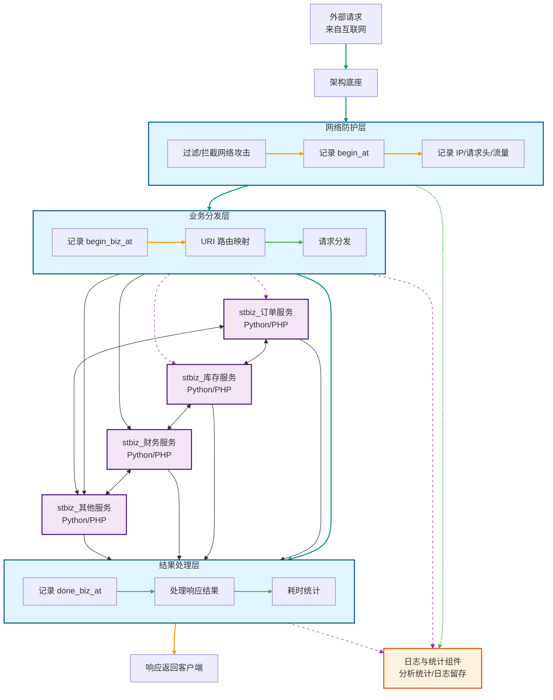

## 系统架构设计

参考互联网分层模型，设计集团公司的ERP系统架构。

### 架构底座

1. 编程语言：使用静态语言如：C, Go
2. 主要职责：外网请求的唯一入口。负责接收，过滤，分发网络请求，记录日志，统计数据。
3. 数据流转：数据在架构底座经过三层流转：网络防护层，业务分发层，结果处理层（负责最终响应，耗时统计等）。
4. 网络防护层：过滤、拦截网络攻击。记录请求进来的时间begin_at。记录请求日志，包括IP，请求头，流量（数据包大小）。
5. 业务分发层：对外业务网络请求的中央调度器。记录请求进来的时间begin_biz_at。通过URI路由映射，分发外部进来的网络请求到业务应用层的微服务。
6. 结果处理层：对外响应请求结果。记录业务应用层完成请求的时间done_biz_at。
7. 日志与统计组件：分析统计业务应用层，各个微服务，网络请求统计，包括耗时统计，API访问统计，报错统计。。。设置日志留存时间，防止存储空间不足。

### 业务应用层

1. 编程语言：使用动态脚本语言。如Python, PHP
2. 主要职责：处理业务逻辑，数据处理与存储。
3. 组织形式：领域驱动设计，按业务场景解耦，明确职责边界。每个业务领域，服务名以stbiz_开头，组成微服务。
4. 数据流转：微服务之间，通过TCP协议调用API接口进行内网通信。

## 系统架构图

